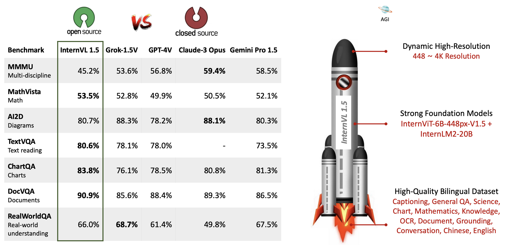
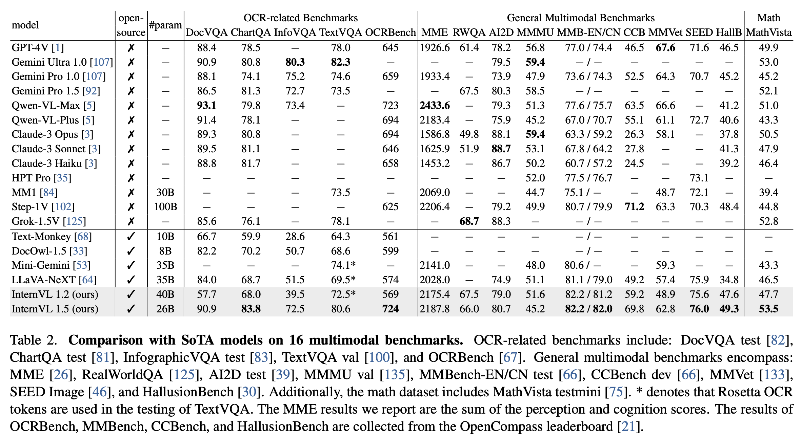

# Introduction of InternVL-Chat-V1-5



We introduce InternVL 1.5, an open-source multimodal large language model (MLLM) to bridge the capability gap between open-source and proprietary commercial models in multimodal understanding. We introduce three simple designs:

1. Strong Vision Encoder: we explored a continuous learning strategy for the large-scale vision foundation model——InternViT-6B, boosting its visual understanding capabilities, and making it can be transferred and reused in different LLMs.

2. Dynamic High-Resolution: we divide images into tiles ranging from 1 to 40 of 448 × 448 pixels according to the aspect ratio and resolution of the input images, which supports up to 4K resolution input.

3. High-Quality Bilingual Dataset: we carefully collected a high-quality bilingual dataset that covers common scenes, document images, and annotated them with English and Chinese question-answer pairs, significantly enhancing performance in OCR- and Chinese-related tasks.


As illustrated in Figure 3, InternVL 1.5 employs an architecture akin to widely-used open-source MLLMs, specifically the “ViT-MLP-LLM” configuration referenced in various existing studies. Our implementation of this architecture integrates a pre-trained InternViT-6B with a pre-trained InternLM2-20B using a randomly initialized MLP projector.

During training, we implemented a dynamic resolution strategy, dividing images into tiles of 448 × 448 pixels in sizes ranging from 1 to 12, based on the aspect ratio and resolution of the input images. During testing, this can be zero-shot scaled up to 40 tiles (i.e., 4K resolution). To enhance scalability for high resolution, we simply employed a pixel shuffle operation to reduce the number of visual tokens to one-quarter of the original. Therefore, in our model, a 448 × 448 image is represented by 256 visual tokens.

## Performance




## Citation

If you find this project useful in your research, please consider citing:

```BibTeX
@article{chen2023internvl,
  title={InternVL: Scaling up Vision Foundation Models and Aligning for Generic Visual-Linguistic Tasks},
  author={Chen, Zhe and Wu, Jiannan and Wang, Wenhai and Su, Weijie and Chen, Guo and Xing, Sen and Zhong, Muyan and Zhang, Qinglong and Zhu, Xizhou and Lu, Lewei and Li, Bin and Luo, Ping and Lu, Tong and Qiao, Yu and Dai, Jifeng},
  journal={arXiv preprint arXiv:2312.14238},
  year={2023}
}
@article{chen2024far,
  title={How Far Are We to GPT-4V? Closing the Gap to Commercial Multimodal Models with Open-Source Suites},
  author={Chen, Zhe and Wang, Weiyun and Tian, Hao and Ye, Shenglong and Gao, Zhangwei and Cui, Erfei and Tong, Wenwen and Hu, Kongzhi and Luo, Jiapeng and Ma, Zheng and others},
  journal={arXiv preprint arXiv:2404.16821},
  year={2024}
}
```

<br>
<br>
