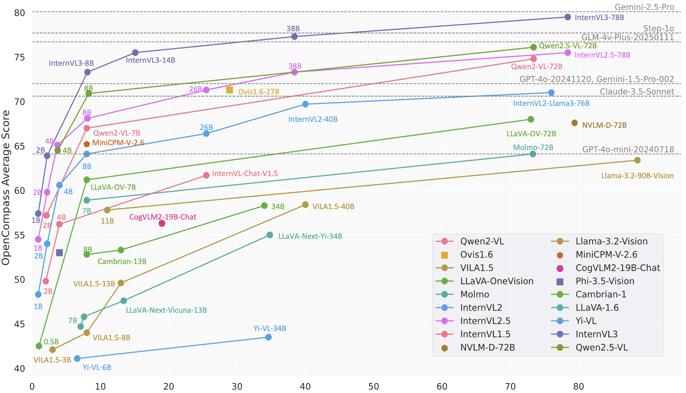
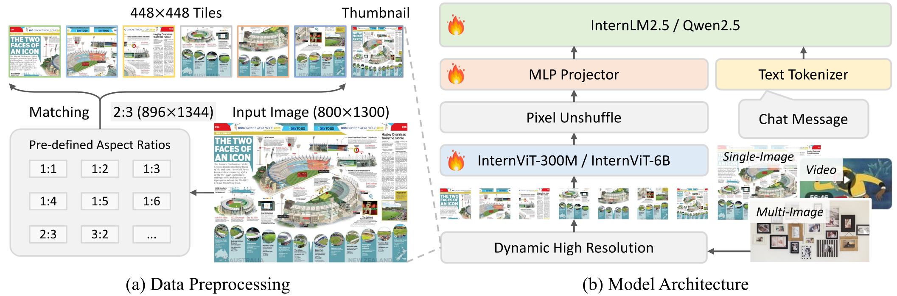
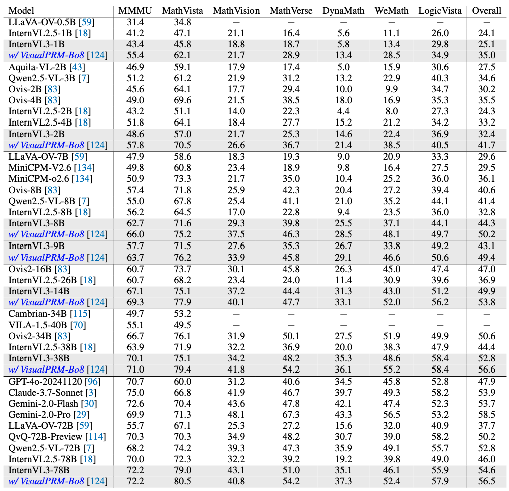

# Introduction of InternVL3.0 Series

We introduce InternVL3, an advanced multimodal large language model (MLLM) series that demonstrates superior overall performance. Compared to InternVL 2.5, InternVL3 exhibits superior multimodal perception and reasoning capabilities, while further extending its multimodal capabilities to encompass tool usage, GUI agents, industrial image analysis, 3D vision perception, and more. Additionally, we compare InternVL3 with Qwen2.5 Chat models, whose corresponding pre-trained base models are employed as the initialization of the langauge component in InternVL3. Benefitting from Native Multimodal Pre-Training, the InternVL3 series achieves even better overall text performance than the Qwen2.5 series.



InternVL3 family is built upon the following designs:

- **Variable Visual Position Encoding**: We integrates the Variable Visual Position Encoding (V2PE) , which utilizes smaller, more flexible position increments for visual tokens. This modification facilitates the handling of longer multimodal contexts without excessively extending the position window.

- **Native Multimodal Pre-Training**: We propose a Native Multimodal Pre-Training approach that consolidates language pre-training and multi-modal alignment training into a single pre-training stage. Unlike conventional paradigms—where a language-only large model is first trained (typically with language pre-training followed by language post-training) and later adapted to accommodate additional modalities—our method performs integrated optimization by interleaving multimodal data (e.g., image–text, video–text, or interleaved image–text sequences) with large-scale textual corpora during the pre-training process. This unified training scheme allows the pre-trainied model to learn both linguistic and multimodal capabilities simultaneously, ultimately enhancing its capability to handle vision-language tasks without introducing additional bridging modules or subsequent inter-model alignment procedures.

- **Mixed Preference Optimization**: During Pre-training and SFT, the model is trained to predict the next token conditioned on previous ground-truth tokens. However, during inference, the model predicts each token based on its own prior outputs. This discrepancy between ground-truth tokens and model-predicted tokens introduces a distribution shift, which can impair the model’s Chain-of-Thought (CoT) reasoning capabilities. To mitigate this issue, we employ Mixed Preference Optimization (MPO) , which introduces additional supervision from both positive and negative samples to align the model response distribution with the ground-truth distribution, thereby improving reasoning performance.

- **Test-Time Scaling with VisualPRM**: Test-Time Scaling has been shown to be an effective method to enhance the reasoning abilities of LLMs and MLLMs. In this work, we use the Best-of-N evaluation strategy and employ VisualPRM-8B as the critic model to select the best response for reasoning and mathematics evaluation.




The architecture of InternVL3 follows the same general framework as its predecessors, adhering to the "ViT-MLP-LLM" paradigm. As in the previous version, we applied a pixel unshuffle operation, reducing the number of visual tokens to one-quarter of the original. Besides, we adopted a similar dynamic resolution strategy as InternVL 1.5, dividing images into tiles of 448×448 pixels. The key difference, starting from InternVL 2.0, is that we additionally introduced support for multi-image and video data. Notably, in InternVL3, we integrate the `Variable Visual Position Encoding (V2PE)` , which utilizes smaller, more flexible position increments for visual tokens. Benefiting from V2PE, InternVL3 exhibits better long context understanding capabilities compared to its predecessors.

|   Model Name    |                                       Vision Part                                       |                                 Language Part                                  |                           HF Link                           |                                MS Link                                 |
| :-------------: | :-------------------------------------------------------------------------------------: | :----------------------------------------------------------------------------: | :---------------------------------------------------------: | :--------------------------------------------------------------------: |
| InternVL3-1B  | [InternViT-300M-448px-V2_5](https://huggingface.co/OpenGVLab/InternViT-300M-448px-V2_5) |            [Qwen2.5-0.5B](https://huggingface.co/Qwen/Qwen2.5-0.5B)            | [🤗 link](https://huggingface.co/OpenGVLab/InternVL3-1B)  | [🤖️ link](https://modelscope.cn/models/OpenGVLab/InternVL3-1B)  |
| InternVL3-2B  | [InternViT-300M-448px-V2_5](https://huggingface.co/OpenGVLab/InternViT-300M-448px-V2_5) |            [Qwen2.5-1.5B](https://huggingface.co/Qwen/Qwen2.5-1.5B)            | [🤗 link](https://huggingface.co/OpenGVLab/InternVL3-2B)  | [🤖️ link](https://modelscope.cn/models/OpenGVLab/InternVL3-2B)  |
| InternVL3-8B  | [InternViT-300M-448px-V2_5](https://huggingface.co/OpenGVLab/InternViT-300M-448px-V2_5) |              [Qwen2.5-7B](https://huggingface.co/Qwen/Qwen2.5-7B)              | [🤗 link](https://huggingface.co/OpenGVLab/InternVL3-8B)  |[🤖️ link](https://modelscope.cn/models/OpenGVLab/InternVL3-8B)  |
| InternVL3-9B  | [InternViT-300M-448px-V2_5](https://huggingface.co/OpenGVLab/InternViT-300M-448px-V2_5) | [internlm3-8b-instruct](https://huggingface.co/internlm/internlm3-8b-instruct) | [🤗 link](https://huggingface.co/OpenGVLab/InternVL3-9B)  |[🤖️ link](https://modelscope.cn/models/OpenGVLab/InternVL3-9B)  |
| InternVL3-14B | [InternViT-300M-448px-V2_5](https://huggingface.co/OpenGVLab/InternViT-300M-448px-V2_5) |             [Qwen2.5-14B](https://huggingface.co/Qwen/Qwen2.5-14B)             | [🤗 link](https://huggingface.co/OpenGVLab/InternVL3-14B) |[🤖️ link](https://modelscope.cn/models/OpenGVLab/InternVL3-14B)  |
| InternVL3-38B |   [InternViT-6B-448px-V2_5](https://huggingface.co/OpenGVLab/InternViT-6B-448px-V2_5)   |             [Qwen2.5-32B](https://huggingface.co/Qwen/Qwen2.5-32B)             | [🤗 link](https://huggingface.co/OpenGVLab/InternVL3-38B) |[🤖️ link](https://modelscope.cn/models/OpenGVLab/InternVL3-38B)  |
| InternVL3-78B |   [InternViT-6B-448px-V2_5](https://huggingface.co/OpenGVLab/InternViT-6B-448px-V2_5)   |             [Qwen2.5-72B](https://huggingface.co/Qwen/Qwen2.5-72B)             | [🤗 link](https://huggingface.co/OpenGVLab/InternVL3-78B) |[🤖️ link](https://modelscope.cn/models/OpenGVLab/InternVL3-78B)  |

|   Model Name    |     HF Link                           |                                MS Link                                 |
| :-------------: | :---------------------------------------------------------: | :--------------------------------------------------------------------: |
|   VisualPRM-8B-v1.1    | [🤗 link](https://huggingface.co/OpenGVLab/VisualPRM-8B-v1.1)                           |  [🤖️ link](https://modelscope.cn/models/VisualPRM-8B-v1.1)                       |

### Evaluation on Multimodal Capability
Multimodal Reasoning and Mathematics ([ALL evaluation](https://internvl.github.io/blog/2025-04-11-InternVL-3.0/))


## Citation

If you find this project useful in your research, please consider citing:

```BibTeX
@misc{zhu2025internvl3exploringadvancedtraining,
      title={InternVL3: Exploring Advanced Training and Test-Time Recipes for Open-Source Multimodal Models}, 
      author={Jinguo Zhu and Weiyun Wang and Zhe Chen and Zhaoyang Liu and Shenglong Ye and Lixin Gu and Hao Tian and Yuchen Duan and Weijie Su and Jie Shao and Zhangwei Gao and Erfei Cui and Xuehui Wang and Yue Cao and Yangzhou Liu and Xingguang Wei and Hongjie Zhang and Haomin Wang and Weiye Xu and Hao Li and Jiahao Wang and Nianchen Deng and Songze Li and Yinan He and Tan Jiang and Jiapeng Luo and Yi Wang and Conghui He and Botian Shi and Xingcheng Zhang and Wenqi Shao and Junjun He and Yingtong Xiong and Wenwen Qu and Peng Sun and Penglong Jiao and Han Lv and Lijun Wu and Kaipeng Zhang and Huipeng Deng and Jiaye Ge and Kai Chen and Limin Wang and Min Dou and Lewei Lu and Xizhou Zhu and Tong Lu and Dahua Lin and Yu Qiao and Jifeng Dai and Wenhai Wang},
      year={2025},
      eprint={2504.10479},
      archivePrefix={arXiv},
      primaryClass={cs.CV},
      url={https://arxiv.org/abs/2504.10479}, 
}
```

<br>
<br>
