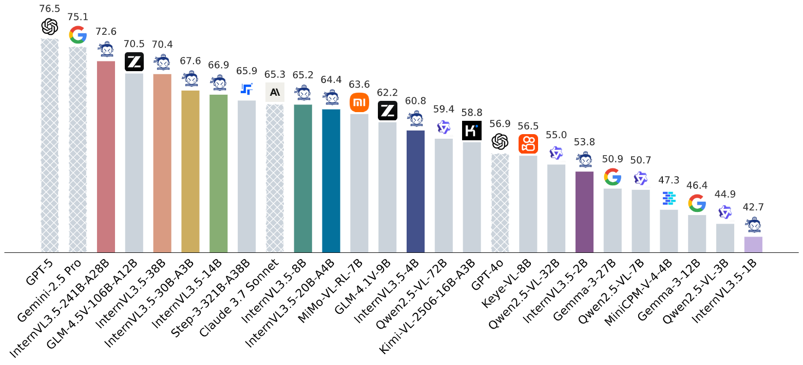
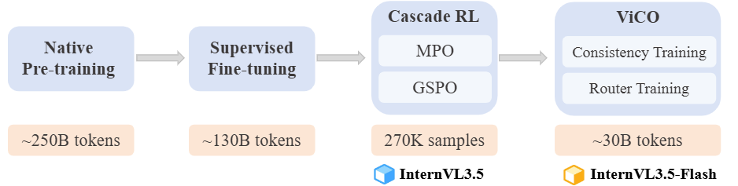
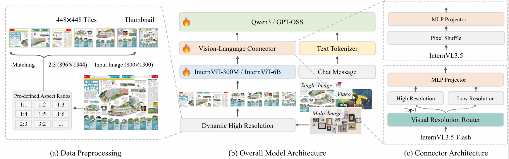
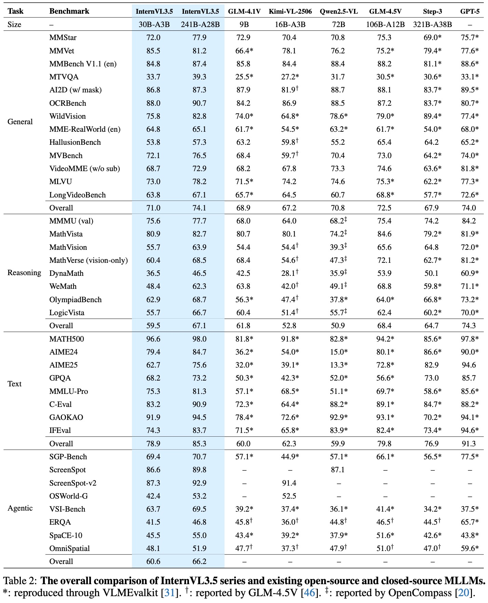

# Introduction of InternVL3.5 Series

We introduce InternVL3.5, a new family of open-source multimodal models that significantly advances versatility, reasoning capability, and inference efficiency along the InternVL series. A key innovation is the Cascade Reinforcement Learning (Cascade RL) framework, which enhances reasoning through a two-stage process: offline RL for stable convergence and online RL for refined alignment. This coarse-to-fine training strategy leads to substantial improvements on downstream reasoning tasks, e.g., MMMU and MathVista. To optimize efficiency, we propose a Visual Resolution Router (ViR) that dynamically adjusts the resolution of visual tokens without compromising performance. Coupled with ViR, our Decoupled Vision-Language Deployment (DvD) strategy separates the vision encoder and language model across different GPUs, effectively balancing computational load. These contributions collectively enable InternVL3.5 to achieve up to a +16.0% gain in overall reasoning performance and a 4.05x inference speedup compared to its predecessor, i.e., InternVL3. In addition, InternVL3.5 supports novel capabilities such as GUI interaction and embodied agency. Notably, our largest model, i.e., InternVL3.5-241B-A28B, attains state-of-the-art results among open-source MLLMs across general multimodal, reasoning, text, and agentic tasks—narrowing the performance gap with leading commercial models like GPT-5. All models and code are publicly released.



`Hatched bars represent closed-source commercial models. We report average scores on a set of multimodal general, reasoning, text, and agentic benchmarks: MMBench v1.1 (en), MMStar,BLINK, HallusionBench, AI2D, OCRBench, MMVet, MME-RealWorld (en), MVBench, VideoMME, MMMU, MathVista, MathVision, MathVerse, DynaMath, WeMath, LogicVista, MATH500, AIME24, AIME25, GPQA, MMLU-Pro, GAOKAO, IFEval, SGP-Bench, VSI-Bench, ERQA, SpaCE-10, and OmniSpatial.`

## InternVL3.5 Family

### Training pipeline
Our training pipeline comprises four stages: Multimodal Continual Pre-Training (CPT), Supervised Fine-Tuning (SFT), and Cascade Reinforcement Learning (CascadeRL). In CascadeRL, we first fine-tune the model using Mixed Preference Optimization (MPO) under an offline RL setting, followed by GSPO under an oneline RL setting. For the Flash version of InternVL3.5, we additionally introduce a lightweight training stage, termed Visual Consistency Learning (ViCO), which reduces the token cost required to represent an image patch.



### Model Architecture

`InternVL3.5`: This series of models follow the "ViT–MLP–LLM" paradigm adopted in previous versions of InternVL. We initialize the language model using the Qwen3 series and GPT-OSS, and the vision encoder using InternViT-300M and InternViT-6B. The Dynamic High Resolution strategy introduced in InternVL1.5 is also retained in our design.

`InternVL3.5-Flash`: Compared to InternVL3.5, InternVL3.5-Flash further integrates the Visual Resolution Router (ViR), thus yielding a series of efficient variants friendly suitable for resource-constrained scenarios. Specifically, in InternVL3.5, each image patch is initially represented as 1024 visual tokens for the vision encoder, which are then compressed into 256 tokens via a pixel shuffle module before being passed to the Large Language Model (LLM). In InternVL3.5-Flash, as shown in the Figure below, an additional pixel shuffle module with a higher compression rate is included, enabling the compression of visual tokens down to 64 tokens. For each patch, the patch router determines the appropriate compression rate by assessing its semantic richness, and routes it to the corresponding pixel shuffle module accordingly. Benefiting from this patch-aware compression mechanism, InternVL3.5-Flash is able to reduce the number of visual tokens by 50% while maintaining nearly 100% of the performance of InternVL3.5.



### Model download

In the following table, we provide an overview of the InternVL3.5 series.
To maintain consistency with earlier generations, we provide two model formats: [the GitHub format](https://huggingface.co/OpenGVLab/InternVL3_5-241B-A28B), consistent with prior releases, and [the HF format](https://huggingface.co/OpenGVLab/InternVL3_5-241B-A28B-HF), aligned with the official Transformers standard.


| Model                 | #Vision Param | #Language Param | #Total Param | HF Link                                                                        | ModelScope Link                                                                          |
| --------------------- | ------------- | --------------- | ------------ | ------------------------------------------------------------------------------ | ---------------------------------------------------------------------------------------- |
| InternVL3.5-1B        | 0.3B          | 0.8B            | 1.1B         | [🤗 link](https://huggingface.co/OpenGVLab/InternVL3_5-1B)                      | [🤖 link](https://www.modelscope.cn/models/OpenGVLab/InternVL3_5-1B)                      |
| InternVL3.5-2B        | 0.3B          | 2.0B            | 2.3B         | [🤗 link](https://huggingface.co/OpenGVLab/InternVL3_5-2B)                      | [🤖 link](https://www.modelscope.cn/models/OpenGVLab/InternVL3_5-2B)                      |
| InternVL3.5-4B        | 0.3B          | 4.4B            | 4.7B         | [🤗 link](https://huggingface.co/OpenGVLab/InternVL3_5-4B)                      | [🤖 link](https://www.modelscope.cn/models/OpenGVLab/InternVL3_5-4B)                      |
| InternVL3.5-8B        | 0.3B          | 8.2B            | 8.5B         | [🤗 link](https://huggingface.co/OpenGVLab/InternVL3_5-8B)                      | [🤖 link](https://www.modelscope.cn/models/OpenGVLab/InternVL3_5-8B)                      |
| InternVL3.5-14B       | 0.3B          | 14.8B           | 15.1B        | [🤗 link](https://huggingface.co/OpenGVLab/InternVL3_5-14B)                     | [🤖 link](https://www.modelscope.cn/models/OpenGVLab/InternVL3_5-14B)                     |
| InternVL3.5-38B       | 5.5B          | 32.8B           | 38.4B        | [🤗 link](https://huggingface.co/OpenGVLab/InternVL3_5-38B)                     | [🤖 link](https://www.modelscope.cn/models/OpenGVLab/InternVL3_5-38B)                     |
| InternVL3.5-20B-A4B   | 0.3B          | 20.9B           | 21.2B-A4B    | [🤗 link](https://huggingface.co/OpenGVLab/InternVL3_5-GPT-OSS-20B-A4B-Preview) | [🤖 link](https://www.modelscope.cn/models/OpenGVLab/InternVL3_5-GPT-OSS-20B-A4B-Preview) |
| InternVL3.5-30B-A3B   | 0.3B          | 30.5B           | 30.8B-A3B    | [🤗 link](https://huggingface.co/OpenGVLab/InternVL3_5-30B-A3B)                 | [🤖 link](https://www.modelscope.cn/models/OpenGVLab/InternVL3_5-30B-A3B)                 |
| InternVL3.5-241B-A28B | 5.5B          | 235.1B          | 240.7B-A28B  | [🤗 link](https://huggingface.co/OpenGVLab/InternVL3_5-241B-A28B)               | [🤖 link](https://www.modelscope.cn/models/OpenGVLab/InternVL3_5-241B-A28B)               |

| Model                    | #Vision Param | #Language Param | #Total Param | HF Link                                                                           | ModelScope Link                                                                             |
| ------------------------ | ------------- | --------------- | ------------ | --------------------------------------------------------------------------------- | ------------------------------------------------------------------------------------------- |
| InternVL3.5-1B-HF        | 0.3B          | 0.8B            | 1.1B         | [🤗 link](https://huggingface.co/OpenGVLab/InternVL3_5-1B-HF)                      | [🤖 link](https://www.modelscope.cn/models/OpenGVLab/InternVL3_5-1B-HF)                      |
| InternVL3.5-2B-HF        | 0.3B          | 2.0B            | 2.3B         | [🤗 link](https://huggingface.co/OpenGVLab/InternVL3_5-2B-HF)                      | [🤖 link](https://www.modelscope.cn/models/OpenGVLab/InternVL3_5-2B-HF)                      |
| InternVL3.5-4B-HF        | 0.3B          | 4.4B            | 4.7B         | [🤗 link](https://huggingface.co/OpenGVLab/InternVL3_5-4B-HF)                      | [🤖 link](https://www.modelscope.cn/models/OpenGVLab/InternVL3_5-4B-HF)                      |
| InternVL3.5-8B-HF        | 0.3B          | 8.2B            | 8.5B         | [🤗 link](https://huggingface.co/OpenGVLab/InternVL3_5-8B-HF)                      | [🤖 link](https://www.modelscope.cn/models/OpenGVLab/InternVL3_5-8B-HF)                      |
| InternVL3.5-14B-HF       | 0.3B          | 14.8B           | 15.1B        | [🤗 link](https://huggingface.co/OpenGVLab/InternVL3_5-14B-HF)                     | [🤖 link](https://www.modelscope.cn/models/OpenGVLab/InternVL3_5-14B-HF)                     |
| InternVL3.5-38B-HF       | 5.5B          | 32.8B           | 38.4B        | [🤗 link](https://huggingface.co/OpenGVLab/InternVL3_5-38B-HF)                     | [🤖 link](https://www.modelscope.cn/models/OpenGVLab/InternVL3_5-38B-HF)                     |
| InternVL3.5-20B-A4B-HF   | 0.3B          | 20.9B           | 21.2B-A4B    | [🤗 link](https://huggingface.co/OpenGVLab/InternVL3_5-GPT-OSS-20B-A4B-Preview-HF) | [🤖 link](https://www.modelscope.cn/models/OpenGVLab/InternVL3_5-GPT-OSS-20B-A4B-Preview-HF) |
| InternVL3.5-30B-A3B-HF   | 0.3B          | 30.5B           | 30.8B-A3B    | [🤗 link](https://huggingface.co/OpenGVLab/InternVL3_5-30B-A3B-HF)                 | [🤖 link](https://www.modelscope.cn/models/OpenGVLab/InternVL3_5-30B-A3B-HF)                 |
| InternVL3.5-241B-A28B-HF | 5.5B          | 235.1B          | 240.7B-A28B  | [🤗 link](https://huggingface.co/OpenGVLab/InternVL3_5-241B-A28B-HF)               | [🤖 link](https://www.modelscope.cn/models/OpenGVLab/InternVL3_5-241B-A28B-HF)               |

## Evaluation on Multimodal Capability
The overall comparison of InternVL3.5 series and existing open-source and closed-source MLLMs. ([ALL evaluation please click here](https://arxiv.org/pdf/2508.18265))


## Citation

If you find this project useful in your research, please consider citing:

```BibTeX
@article{wang2025internvl3_5,
  title={InternVL3.5: Advancing Open-Source Multimodal Models in Versatility, Reasoning, and Efficiency},
  author={Wang, Weiyun and Gao, Zhangwei and Gu, Lixin and Pu, Hengjun and Cui, Long and Wei, Xingguang and Liu, Zhaoyang and Jing, Linglin and Ye, Shenglong and Shao, Jie and others},
  journal={arXiv preprint arXiv:2508.18265},
  year={2025}
}
```

<br>
<br>
